# HƯỚNG DẪN SỬ DỤNG VIRAL SHORT STUDIO

Tài liệu dành cho người dùng cuối. Đọc từ đầu đến cuối một lần, sau đó dùng phần **Tra cứu nhanh** ở cuối khi cần.

Phần mềm chạy **hoàn toàn trên máy bạn**. Video không đi qua máy chủ của bất kỳ ai.

---

# PHẦN A — CHUẨN BỊ MÁY

## A1. Máy cần gì

| Hạng mục | Yêu cầu | Ghi chú |
|---|---|---|
| Hệ điều hành | Windows 10/11 hoặc macOS | Bộ cài lo phần còn lại |
| Ổ cứng trống | Tối thiểu 50 GB | Video tạm chiếm rất nhiều chỗ |
| Card màn hình | NVIDIA (nếu có) | Có thì render nhanh gấp nhiều lần; không có vẫn chạy được bằng CPU |
| RAM | 8 GB trở lên | 16 GB thì mượt |
| Tài khoản Claude | Cần | Phần AI chọn đoạn, viết caption |
| Tài khoản Lark | Tuỳ chọn | Chỉ cần nếu muốn video tự đưa về Lark Base |

## A2. Cài đặt (làm một lần duy nhất)

**Bước 1.** Giải nén file `VIRAL-SHORT-STUDIO.zip` ra một thư mục. Nên đặt ở ổ còn nhiều chỗ trống, ví dụ `D:\VIRAL-SHORT-STUDIO`.

> ⚠️ Phải **giải nén** rồi mới dùng. Chạy trực tiếp bên trong file `.zip` sẽ lỗi.

**Bước 2.** Vào thư mục vừa giải nén, bấm đúp file:

```
CÀI ĐẶT (chạy 1 lần).bat
```

Máy sẽ tự tải và cài: Node.js, FFmpeg, Python, faster-whisper (bộ nghe tiếng nói), yt-dlp (tải video từ link), Claude CLI, lark-cli. Quá trình mất 10–30 phút tuỳ mạng.

> 💡 Nếu cửa sổ báo "vừa cài xong bộ nền, hãy mở lại file này lần nữa" thì cứ đóng đi và bấm đúp lại — đó là bước bình thường để máy nhận đường dẫn mới.

**Trên máy Mac:** bấm đúp `CÀI ĐẶT (Mac).command` thay cho file `.bat`.

## A3. Đăng nhập hai tài khoản

Mở **Command Prompt** (Windows: bấm phím Windows, gõ `cmd`, Enter) hoặc **Terminal** (Mac), gõ lần lượt:

```
claude login
```

Trình duyệt mở ra, đăng nhập tài khoản Claude của bạn. Xong quay lại cửa sổ đen, gõ tiếp:

```
lark-cli login
```

Đăng nhập tài khoản Lark **có quyền chỉnh sửa** Base bạn định dùng. Hai lệnh này chỉ làm một lần cho mỗi máy.

## A4. Kiểm tra máy đã đủ chưa

Trong thư mục phần mềm, mở Command Prompt tại đó rồi gõ:

```
node "KIỂM TRA HỆ THỐNG.mjs"
```

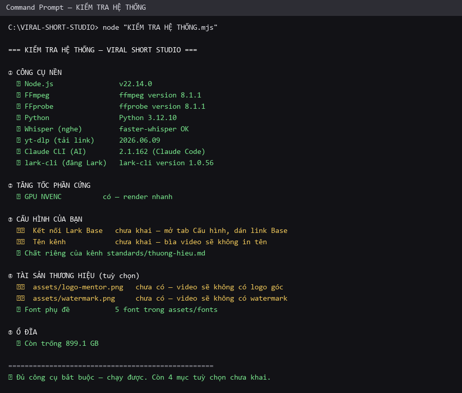

Cách đọc kết quả:

| Dấu hiệu | Nghĩa là | Cần làm gì |
|---|---|---|
| ✅ màu xanh | Đủ, chạy được | Không phải làm gì |
| ⚠️ màu vàng | Thiếu thứ **tuỳ chọn** | Vẫn dùng được; khai thêm khi cần tính năng đó |
| ❌ màu đỏ | Thiếu thứ **bắt buộc** | Chạy lại `CÀI ĐẶT (chạy 1 lần).bat` |

Công cụ này không gọi AI nên **không tốn phí**. Chạy lại bất cứ lúc nào máy có vẻ trục trặc.

---

# PHẦN B — LÀM QUEN GIAO DIỆN

## B1. Mở phần mềm

Bấm đúp `MỞ PHẦN MỀM.vbs`. Một cửa sổ ứng dụng hiện ra (không có thanh địa chỉ trình duyệt).

> 💡 Muốn có lối tắt ngoài màn hình: bấm đúp `TẠO LỐI TẮT MÀN HÌNH.vbs` một lần.

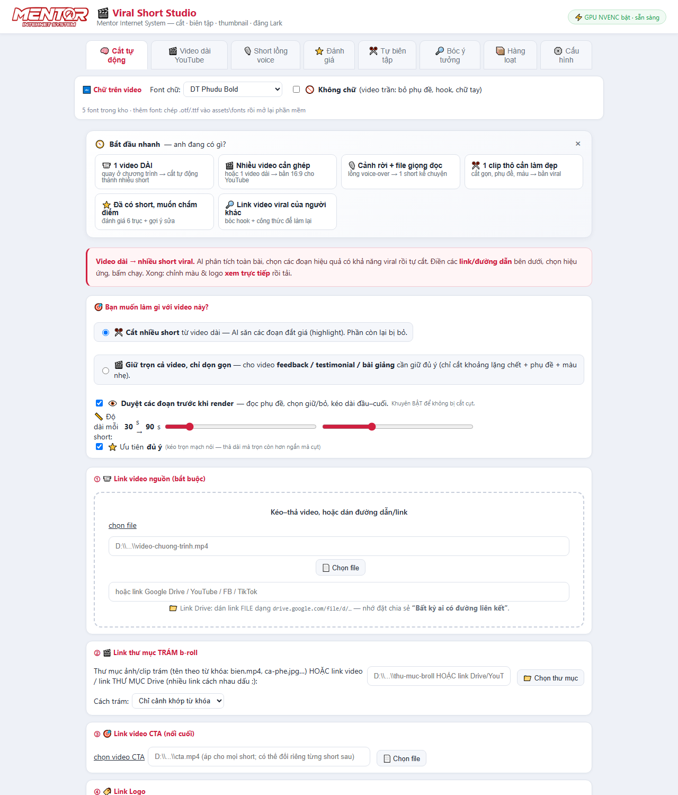

## B2. Đầu trang và thanh chọn chức năng

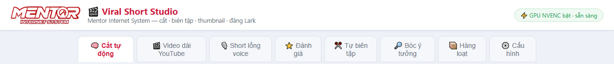

| Vị trí | Nội dung |
|---|---|
| Góc trái | Logo và tên phần mềm |
| Góc phải | Tình trạng máy. **"GPU NVENC bật · sẵn sàng"** nghĩa là máy dùng card đồ hoạ để render — nhanh. Nếu ghi khác thì máy dùng CPU, vẫn chạy nhưng lâu hơn |
| Hàng thẻ | 8 chức năng. Bấm để chuyển qua lại, không mất dữ liệu đang điền |

## B3. Thanh "Chữ trên video" — áp cho mọi chức năng

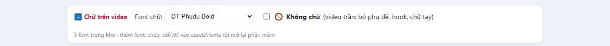

Thanh này nằm **ngoài** các thẻ chức năng vì nó áp dụng cho tất cả — để phụ đề, chữ tiêu đề, chữ trên bìa luôn đồng nhất một kiểu.

| Ô | Ý nghĩa |
|---|---|
| **Font chữ** | Chọn phông cho toàn bộ chữ trên video. Muốn thêm phông: chép file `.otf` hoặc `.ttf` vào thư mục `assets\fonts` rồi mở lại phần mềm |
| **🚫 Không chữ** | Tích vào là ra **video trần**: không phụ đề, không chữ tiêu đề, không chữ tay. Dùng khi bạn muốn tự thêm chữ ở phần mềm khác |

## B4. Khối "Bắt đầu nhanh"

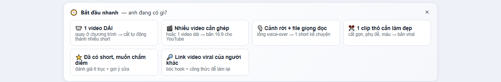

Nếu chưa biết chọn chức năng nào, đọc khối này: nó hỏi **bạn đang có gì trong tay** rồi tự nhảy đến đúng chỗ. Bấm dấu **×** để ẩn đi khi đã quen.

## B5. Chân trang

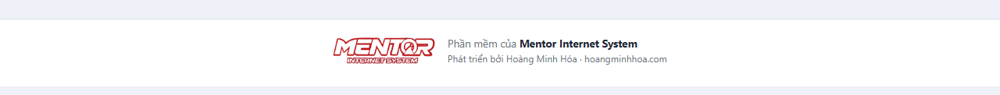

---

# PHẦN C — KẾT NỐI LARK BASE

Mục đích: video làm xong **tự chạy về một bảng Lark Base của bạn** — caption vào cột nội dung, file video và ảnh bìa vào cột đính kèm. Bạn chỉ việc vào Base duyệt rồi đăng.

> Không dùng Lark cũng không sao. Bỏ qua toàn bộ phần C, mọi chức năng làm video vẫn chạy đủ, chỉ là bạn tải video về máy thủ công.

## C1. Chuẩn bị bảng trong Lark Base

Tạo (hoặc dùng bảng có sẵn) với các cột sau:

| Cột | Kiểu trong Lark | Bắt buộc | Chứa gì |
|---|---|---|---|
| Nội dung | Văn bản nhiều dòng | Nên có | Caption do AI viết |
| Ảnh/video | **Tệp đính kèm** | ✅ **Bắt buộc** | File video thành phẩm |
| Thumbnail | Tệp đính kèm | Tuỳ chọn | Ảnh bìa |
| Loại | Lựa chọn (Select) | Tuỳ chọn | Đánh dấu "Video" |
| Kênh đăng | Liên kết bảng khác | Tuỳ chọn | Gắn về kênh sẽ đăng |

Tên cột đặt thế nào cũng được — ở bước C3 bạn sẽ tự chỉ cột nào là cột nào.

## C2. Mở thẻ ⚙️ Cấu hình

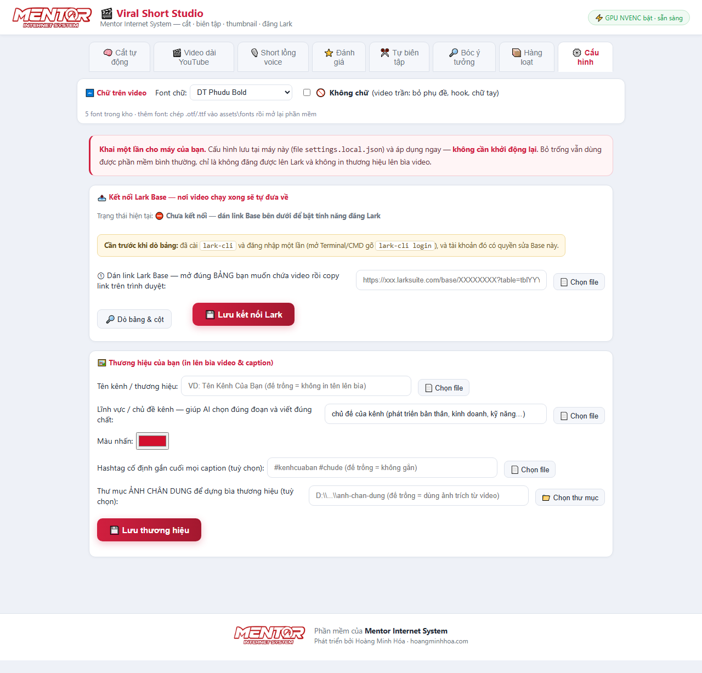

Dòng **"Trạng thái hiện tại"** đang báo *"⛔ Chưa kết nối"*. Khối vàng nhắc điều kiện: phải đã chạy `lark-cli login` (mục A3) và tài khoản đó có quyền vào Base.

## C3. Ba bước nối

**Bước ①** — Mở Lark Base trên trình duyệt, vào **đúng bảng** muốn chứa video, copy đường dẫn trên thanh địa chỉ. Link có dạng:

```
https://xxx.larksuite.com/base/XXXXXXXXXXXX?table=tblYYYYYYYY&view=vewZZZZ
```

Dán vào ô ① rồi bấm **🔎 Dò bảng & cột**.

**Bước ②** — Phần mềm liệt kê toàn bộ bảng có trong Base đó. Chọn bảng ở ô ②, rồi bấm **↻ Nạp cột của bảng này**.

**Bước ③** — Chỉ cột nào là cột nào:

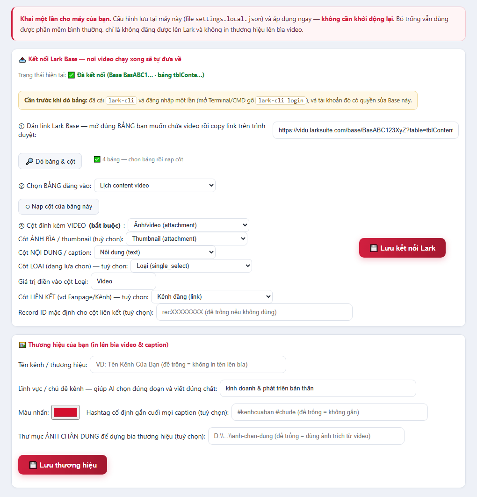

| Ô | Bắt buộc | Chọn cột nào |
|---|---|---|
| **Cột đính kèm VIDEO** | ✅ Có | Cột kiểu **attachment** — nơi chứa file video |
| Cột ẢNH BÌA / thumbnail | Không | Cột attachment khác, chứa ảnh bìa |
| Cột NỘI DUNG / caption | Không | Cột văn bản, chứa caption |
| Cột LOẠI | Không | Cột kiểu lựa chọn |
| Giá trị điền vào cột Loại | Không | Chữ sẽ điền, ví dụ `Video` |
| Cột LIÊN KẾT | Không | Cột liên kết sang bảng khác (Fanpage/Kênh) |
| Record ID mặc định | Không | Mã bản ghi để gắn sẵn, dạng `recXXXXXXXX` |

Bấm **💾 Lưu kết nối Lark**. Dòng trạng thái chuyển thành **✅ Đã kết nối** là xong. **Không cần khởi động lại phần mềm.**

## C4. Khai thương hiệu của bạn

Ngay dưới phần Lark, trong cùng thẻ Cấu hình:

| Ô | Tác dụng | Để trống thì sao |
|---|---|---|
| **Tên kênh / thương hiệu** | In lên bìa video | Bìa không có tên |
| **Lĩnh vực / chủ đề kênh** | Giúp AI chọn đoạn và viết caption đúng chất kênh bạn | AI chọn theo cách chung |
| **Màu nhấn** | Màu chủ đạo trên bìa | Dùng màu mặc định |
| **Hashtag cố định** | Gắn vào cuối mọi caption | Không gắn hashtag |
| **Thư mục ảnh chân dung** | Ảnh nền cho bìa thương hiệu | Dùng ảnh cắt từ chính video |

Bấm **💾 Lưu thương hiệu**.

> 💡 Muốn AI hiểu kênh bạn sâu hơn nữa: mở file `standards\thuong-hieu.md` bằng Notepad và viết vào đó kênh nói về gì, người xem là ai, đoạn nào là "đắt", đoạn nào không dùng. AI đọc file này mỗi lần chọn đoạn.

## C5. Cấu hình lưu ở đâu

File `settings.local.json` ngay trong thư mục phần mềm.

- **Sao lưu file này** = giữ được toàn bộ thiết lập, đổi máy chỉ cần chép sang.
- **Không gửi file này cho ai** — nó chứa mã Base riêng của bạn.

---

# PHẦN D — BẢY CHỨC NĂNG

## D1. 🧠 Cắt tự động — dùng nhiều nhất

**Dùng khi:** bạn có **1 video dài** (buổi dạy, livestream, hội thảo, phỏng vấn) và muốn ra **nhiều video ngắn**.

**Không dùng khi:** video đã là short dọc có sẵn phụ đề (sẽ bị chồng hai lớp chữ), hoặc video cần giữ trọn vẹn như feedback/testimonial (dùng chế độ "Giữ trọn cả video" bên dưới).

### Khối 1 — Bạn muốn làm gì với video này

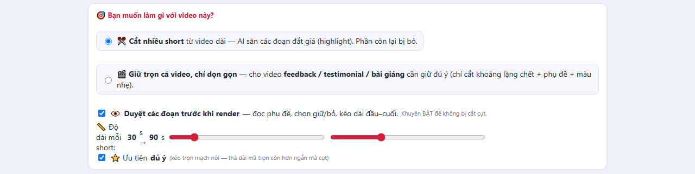

| Lựa chọn | Kết quả |
|---|---|
| **✂️ Cắt nhiều short** | AI săn các đoạn đắt giá, phần còn lại bỏ đi. Ra nhiều video ngắn |
| **🎬 Giữ trọn cả video, chỉ dọn gọn** | Giữ đủ nội dung, chỉ cắt khoảng lặng chết, thêm phụ đề và màu nhẹ. Dùng cho feedback, testimonial, bài giảng |

| Tuỳ chọn | Ý nghĩa |
|---|---|
| **👁️ Duyệt các đoạn trước khi render** | **Nên luôn bật.** AI chọn xong sẽ hiện bảng cho bạn nghe thử từng đoạn, chỉnh mép cắt, bỏ đoạn không ưng — rồi mới render |
| **📏 Độ dài mỗi short** | Kéo hai thanh trượt để đặt khoảng thời lượng mong muốn, mặc định 30–90 giây |
| **⭐ Ưu tiên đủ ý** | Cho phép AI kéo dài đoạn để trọn mạch nói, thay vì cắt ngắn mà cụt ý |

### Khối 2 — Sáu ô đầu vào

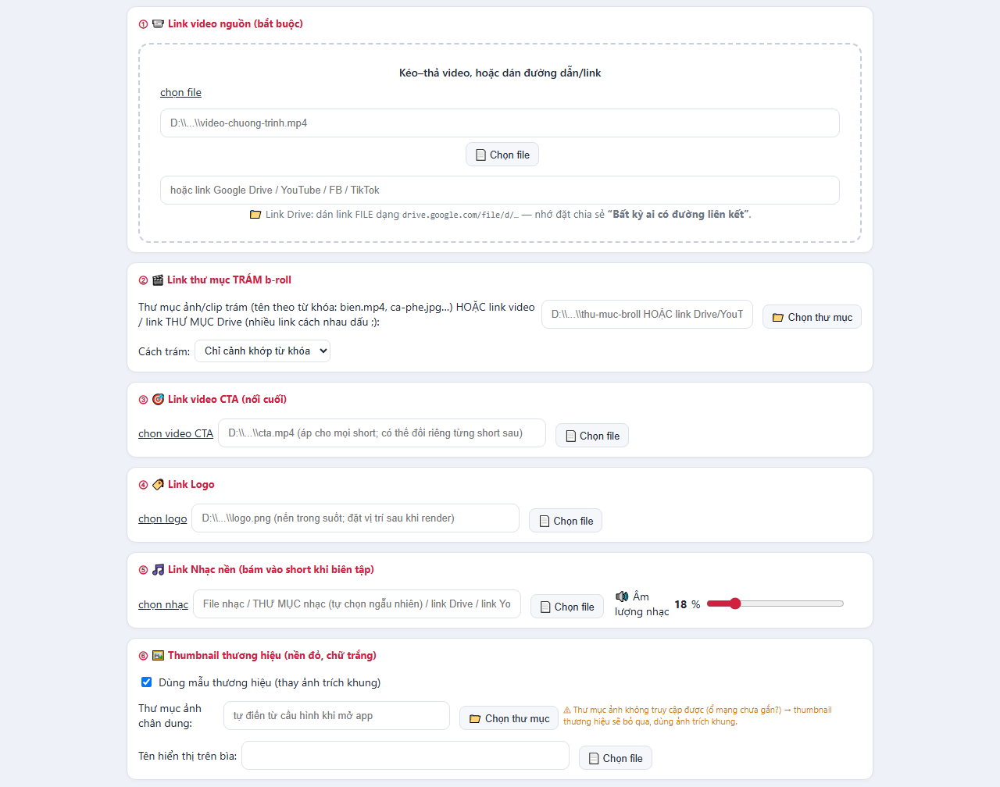

| Ô | Bắt buộc | Nhập gì |
|---|---|---|
| **① Link video nguồn** | ✅ Có | Kéo–thả file vào khung, bấm "Chọn file", dán đường dẫn, **hoặc dán link Google Drive / YouTube / Facebook / TikTok**. Link Drive nhớ đặt chia sẻ "Bất kỳ ai có đường liên kết" |
| **② Link thư mục TRÁM b-roll** | Không | Thư mục chứa ảnh/clip minh hoạ. **Đặt tên file theo từ khoá** (ví dụ `bien.mp4`, `ca-phe.jpg`) — phần mềm khớp từ khoá với lời nói để chèn đúng chỗ. "Cách trám": *Chỉ cảnh khớp từ khoá* hoặc *Trám dày* |
| **③ Link video CTA** | Không | Clip kêu gọi hành động, nối vào **cuối** mỗi short. Có thể đổi riêng cho từng short sau khi render |
| **④ Link Logo** | Không | File PNG nền trong suốt. Vị trí, kích thước, độ mờ chỉnh trực tiếp sau khi render |
| **⑤ Link Nhạc nền** | Không | Một file nhạc, hoặc cả **thư mục nhạc** (phần mềm tự chọn ngẫu nhiên), hoặc link. Nhạc ngắn hơn video sẽ **tự lặp**. Thanh **Âm lượng nhạc** mặc định 18% |
| **⑥ Thumbnail thương hiệu** | Không | Bật để dùng mẫu bìa nền đỏ chữ trắng. Điền thư mục ảnh chân dung và tên hiển thị (tự điền từ thẻ Cấu hình) |

### Khối 3 — Tuỳ chọn AI và hiệu ứng

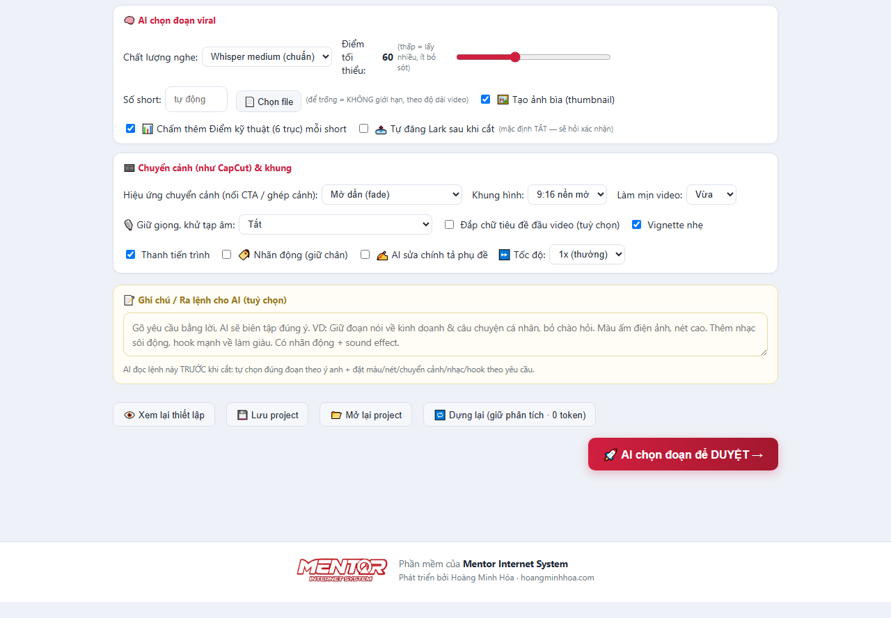

**Cột trái — AI chọn đoạn viral**

| Ô | Ý nghĩa | Khuyên dùng |
|---|---|---|
| Chất lượng nghe | *medium* chuẩn hơn, *small* nhanh hơn | medium |
| Điểm tối thiểu | Ngưỡng chấm để giữ đoạn. Số **thấp = lấy nhiều đoạn hơn**, ít bỏ sót | 60 |
| Số short | Để trống = **không giới hạn**, AI lấy hết đoạn đáng giá | Để trống |
| 🖼️ Tạo ảnh bìa | Tự sinh thumbnail cho mỗi short | Bật |
| 📊 Chấm thêm Điểm kỹ thuật | Chấm 6 trục cho từng short | Bật |
| 📤 Tự đăng Lark sau khi cắt | Chạy xong tự đưa về Base. Mặc định tắt, có hỏi xác nhận | Tuỳ bạn |

**Cột phải — Chuyển cảnh, khung hình và hiệu ứng**

| Ô | Ý nghĩa |
|---|---|
| Hiệu ứng chuyển cảnh | 9 kiểu: mờ dần, mờ qua đen, trượt ngang, trượt lên, gạt màn, mở vòng tròn, hoà tan, phóng to, cắt thẳng |
| Khung hình | *9:16 nền mờ* (giữ trọn hình, hai đầu làm mờ) hoặc *9:16 cắt đầy* (cắt sát, hình đầy màn) |
| Làm mịn video | Khử nhiễu, mịn da. Video quay ở hội trường nhiều hạt nên để **Vừa** |
| 🎙️ Giữ giọng, khử tạp âm | Từ *Nhẹ* đến *Mạnh*. Mức **🎤 Tách nhạc (AI)** bóc hẳn nhạc nền, chỉ giữ giọng người |
| Đắp chữ tiêu đề đầu video | Chèn dòng chữ lớn ở đầu |
| Vignette nhẹ | Tối nhẹ bốn góc cho chất điện ảnh |
| Thanh tiến trình | Vạch chạy dưới đáy video |
| 🏷️ Nhãn động | Sticker nhỏ nhảy ở điểm nhấn để giữ chân người xem |
| ✍️ AI sửa chính tả phụ đề | Sửa lỗi máy nghe nhầm. **Nên bật với tiếng Việt** |
| ⏩ Tốc độ | Tăng tốc toàn video từ 1x đến 3x |

### Khối 4 — Ra lệnh bằng lời

Ô **📝 Ghi chú / Ra lệnh cho AI** nhận yêu cầu viết bằng tiếng Việt thường, ví dụ:

> *Giữ đoạn nói về tuyển dụng và câu chuyện cá nhân, bỏ phần chào hỏi. Màu ấm điện ảnh, nét cao. Thêm nhạc sôi động. Có nhãn động.*

**Lệnh này thắng mọi thiết lập bạn chọn ở trên.** AI đọc trước khi cắt, tự chọn đúng đoạn theo ý bạn và tự đặt màu, nét, chuyển cảnh, nhạc.

### Khối 5 — Các nút chạy

| Nút | Tác dụng |
|---|---|
| 👁️ Xem lại thiết lập | Liệt kê toàn bộ lựa chọn để rà trước khi chạy |
| 💾 Lưu project | Lưu mọi ô đã điền thành file `.vss.json` trong thư mục `projects` |
| 📂 Mở lại project | Mở lại dự án đã lưu, kể cả từ USB hay máy khác |
| 🔁 Dựng lại | Render lại bằng phân tích cũ — **không tốn phí AI** |
| 🚀 **AI cắt video thành loạt short** | Nút chạy chính |

## D2. 🎬 Video dài YouTube

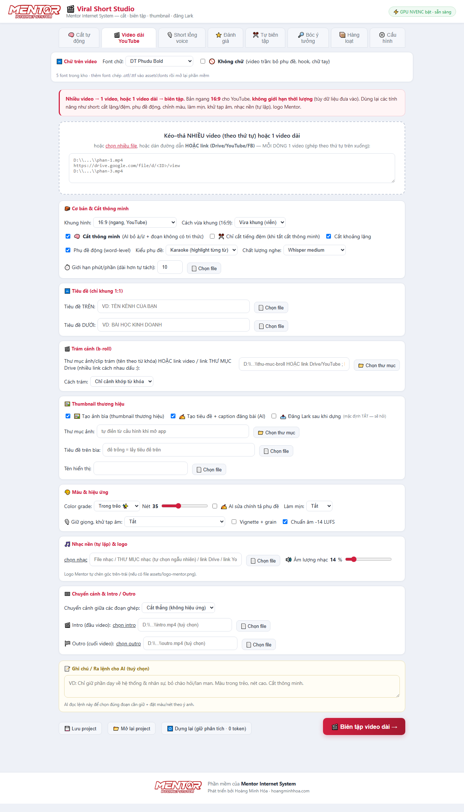

**Dùng khi:** ghép nhiều video thành một, hoặc dọn một video dài thành bản hoàn chỉnh cho YouTube.

Ô nhập nhận **mỗi dòng một video** — ghép theo thứ tự từ trên xuống, và mỗi dòng có thể là đường dẫn file hoặc link Drive/YouTube.

| Nhóm tuỳ chọn | Nội dung chính |
|---|---|
| 🧱 Cơ bản & Cắt thông minh | Khung 16:9 (ngang) hoặc 1:1 (vuông có thanh tiêu đề trên/dưới); cách vừa khung; cắt bỏ đoạn không truyền tải tri thức |
| 🔤 Tiêu đề (chỉ khung 1:1) | Chữ chạy trên thanh đỏ phía trên và phía dưới |
| 🎬 Trám cảnh (b-roll) | Như chức năng Cắt tự động |
| 🖼️ Thumbnail thương hiệu | Sinh ảnh bìa cho video |
| 🎨 Màu & hiệu ứng | Màu, độ nét, làm mịn, khử tạp âm |
| 🎵 Nhạc nền & logo | Nhạc tự lặp, âm lượng, logo |
| 🎞️ Chuyển cảnh & Intro/Outro | Hiệu ứng nối, clip mở đầu và kết |

> Video dài quá 10 phút sẽ **tự tách thành nhiều phần**.

## D3. 🎙️ Short lồng voice

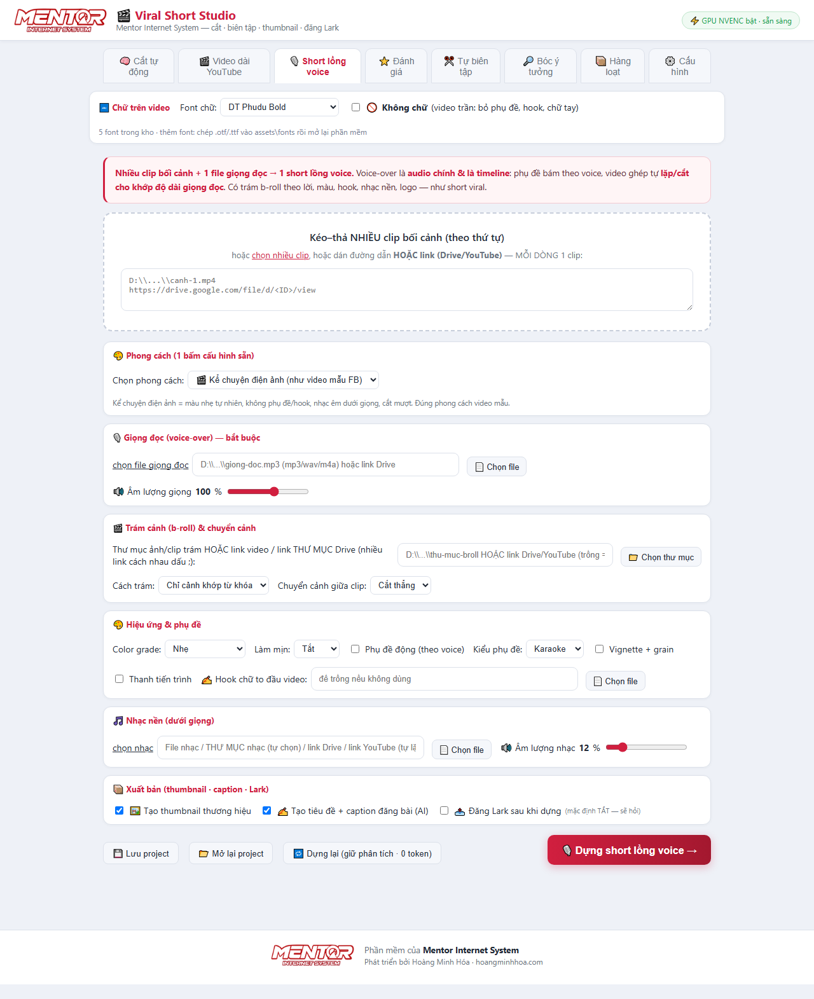

**Dùng khi:** bạn có **file giọng đọc** (thu sẵn hoặc do AI đọc) và các **cảnh rời**, muốn ghép thành một short kể chuyện.

Điểm khác biệt: hình **tự lặp hoặc tự cắt cho khớp độ dài giọng đọc**, phụ đề bám theo giọng.

| Nhóm | Nội dung |
|---|---|
| 🎨 Phong cách | Các cấu hình dựng sẵn, bấm một nút là xong |
| 🎙️ Giọng đọc | **Bắt buộc** — file mp3/wav/m4a hoặc link |
| 🎬 Trám cảnh & chuyển cảnh | Cảnh minh hoạ theo lời |
| 🎨 Hiệu ứng & phụ đề | Màu, chữ |
| 🎵 Nhạc nền | Đặt dưới giọng đọc |
| 📦 Xuất bản | Thumbnail, caption, đăng Lark |

## D4. ⭐ Đánh giá

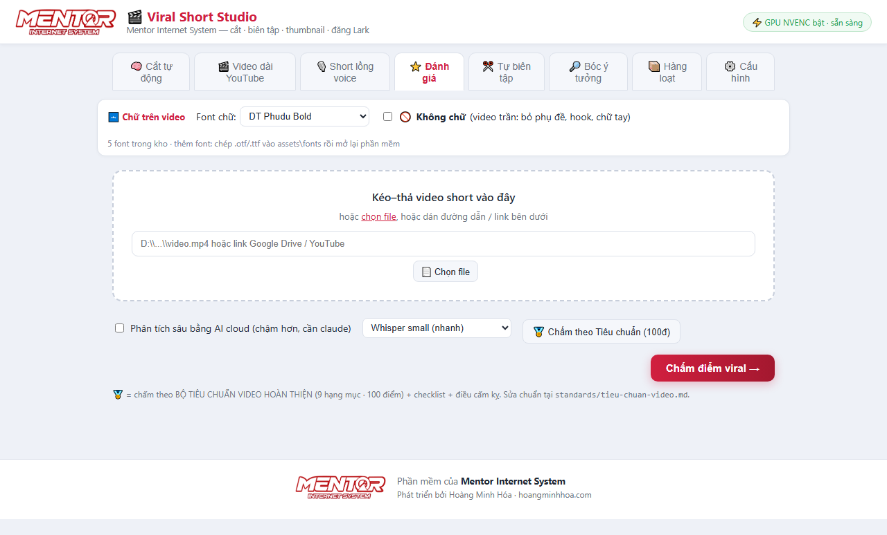

**Dùng khi:** đã có short (của bạn hoặc của người khác) và muốn biết mạnh yếu ở đâu.

Kết quả: điểm theo 6 trục, danh sách **điều cấm kỵ đang vi phạm**, và 3–5 **việc cần sửa** xếp theo ưu tiên.

## D5. ✂️ Tự biên tập

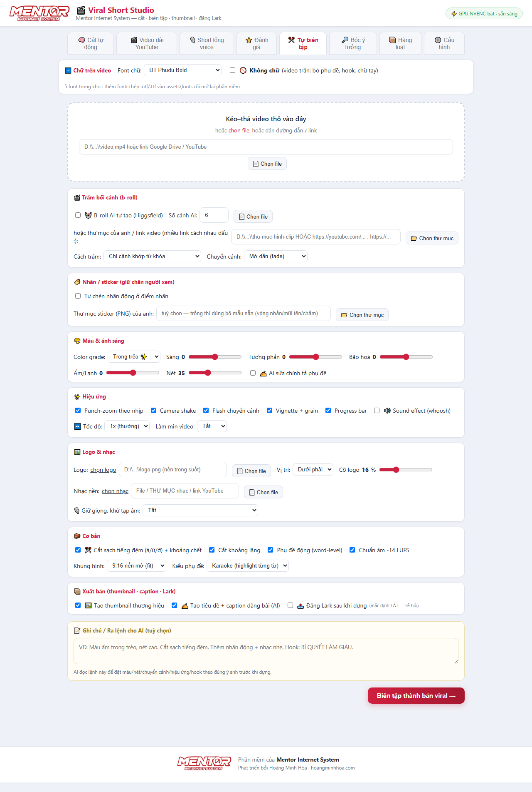

**Dùng khi:** có **một clip thô** cần làm đẹp, không cần AI chọn đoạn.

| Nhóm | Nội dung |
|---|---|
| 🎬 Trám bối cảnh | Chèn b-roll |
| 🏷️ Nhãn / sticker | Giữ chân người xem |
| 🎨 Màu & ánh sáng | Bốn thanh trượt: Sáng, Tương phản, Bão hoà, Ấm–Lạnh |
| ✨ Hiệu ứng | Cắt khoảng lặng, bỏ tiếng đệm "à/ừ", phụ đề, làm mịn, khử tạp âm |
| 🖼️ Logo & nhạc | Logo (vị trí, cỡ, độ mờ) và nhạc nền |
| 🧱 Cơ bản | Khung hình, tốc độ |
| 📦 Xuất bản | Thumbnail, caption, đăng Lark |

## D6. 🔎 Bóc ý tưởng

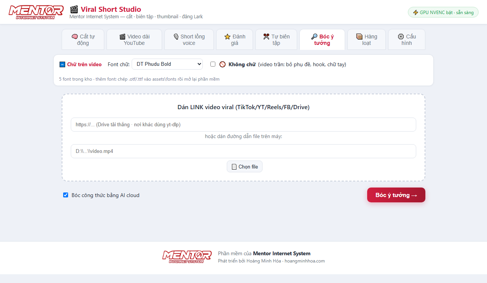

**Dùng khi:** thấy một video viral hay và muốn hiểu **vì sao nó hay**.

Dán link (YouTube, TikTok, Facebook) hoặc đường dẫn file. Phần mềm tải về, nghe, rồi bóc ra: hook mở đầu, cấu trúc, công thức để bạn làm lại theo cách của mình.

## D7. 📦 Hàng loạt

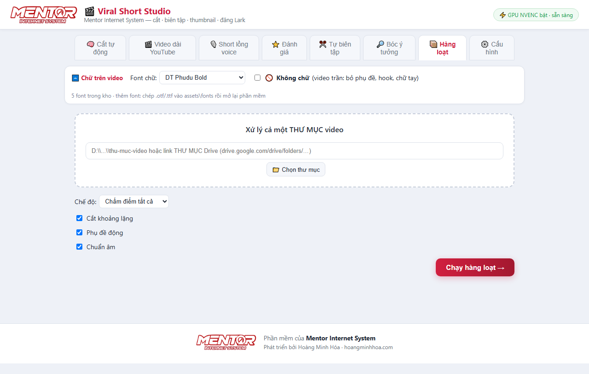

**Dùng khi:** có **cả thư mục video** cần xử lý cùng một kiểu.

Trỏ vào thư mục trên máy hoặc **link thư mục Google Drive**, chọn kiểu xử lý (chấm điểm tất cả / biên tập viral tất cả), bấm chạy rồi đi làm việc khác.

---

# PHẦN E — SAU KHI BẤM CHẠY

## E1. Theo dõi tiến trình

Khung log ở cuối trang hiện từng bước máy đang làm: tải video → nghe và gõ chữ → AI chọn đoạn → cắt → phụ đề → màu → nhạc → xuất file.

**Thời gian tham khảo** (video 60 phút, máy có GPU): 20–40 phút. Máy không GPU: gấp 2–3 lần.

## E2. Duyệt các đoạn trước khi render

Nếu bật "👁️ Duyệt các đoạn", sau khi AI chọn xong sẽ hiện bảng duyệt. Đây là **bước quyết định chất lượng**:

| Thao tác | Cách làm |
|---|---|
| Nghe thử một đoạn | Bấm **▶ Xem thử** — video nhảy đúng đoạn đó và tự dừng ở cuối đoạn |
| Kéo dài / rút ngắn | Bấm các nút **±1s** và **±3s** ở đầu hoặc cuối. Bấm xong máy **tự phát lại 4 giây quanh mép vừa chỉnh** để bạn nghe câu đã trọn chưa |
| Bỏ đoạn không ưng | Bỏ tích ô "giữ" |
| Đọc trước nội dung | Mỗi đoạn hiện sẵn phụ đề, trọng điểm và điểm chấm |

Xong bấm **"Render các đoạn đã duyệt"**.

## E3. Chỉnh trực tiếp trên kết quả

Ở phần kết quả, mỗi video có bảng điều khiển riêng:

| Việc | Cách làm |
|---|---|
| Đặt logo | **Kéo–thả logo ngay trên video**, hoặc dùng nút ◀ ▲ ▼ ▶ và 🔍−/+ để chỉnh từng nấc |
| Chỉnh màu | Ba thanh Sáng / Tương phản / Bão hoà — **thấy đổi ngay trên video** |
| Nhạc nền | Chọn file và kéo âm lượng |
| Video CTA | Mỗi short chọn CTA riêng được |
| Nghe thử | **▶ Xem trước (có nhạc)** — nghe đúng bản sẽ tải về |
| Tải về | **⬇ Tải kèm logo/nhạc/CTA** — nướng đúng như bạn đang thấy. Hoặc "Bản gốc" để tải bản chưa chỉnh |

> ⚠️ Đổi logo/nhạc/CTA sau khi đã xem trước thì bản xem trước bị huỷ — bấm xem trước lại để bản tải luôn khớp cái bạn vừa nghe.

## E4. Đưa về Lark Base

- **Tự động:** bật "📤 Tự đăng Lark" từ đầu.
- **Thủ công:** bấm nút đăng ở từng video trong phần kết quả.

Mỗi short thành **một dòng** trong Base: caption vào cột nội dung, file video và ảnh bìa vào cột đính kèm.

## E5. Video nằm ở đâu

Thư mục `work\out\` trong thư mục phần mềm, chia theo từng lần chạy.

---

# PHẦN F — SÁU NGUYÊN TẮC ĐỂ VIDEO RA HAY

1. **Mỗi short chỉ một trọng điểm.** Một khái niệm, trọn vẹn, người lạ xem không cần biết gì trước đó vẫn hiểu. Tham nhiều ý thì không ai nhớ gì.
2. **Thà dài mà trọn còn hơn ngắn mà cụt.** Đừng ép 30 giây nếu ý cần 80 giây. Bật "⭐ Ưu tiên đủ ý".
3. **Không cắt giữa câu.** Bảng duyệt có nút ±1s chính là để sửa việc này — nghe lại mép cắt trước khi render.
4. **Chọn đúng chế độ.** Video feedback/testimonial/bài giảng cần giữ đủ ý thì chọn "Giữ trọn cả video", đừng dùng Cắt tự động (nó là thợ săn highlight, vứt phần lớn video).
5. **Đừng đưa short đã có phụ đề vào Cắt tự động** — sẽ chồng hai lớp chữ. Chức năng này dành cho video gốc quay ngang.
6. **Tận dụng ô ra lệnh bằng lời.** Một câu tiếng Việt rõ ràng thường hiệu quả hơn chỉnh mười ô tuỳ chọn.

---

# PHẦN G — XỬ LÝ SỰ CỐ

| Hiện tượng | Nguyên nhân thường gặp | Cách xử lý |
|---|---|---|
| Bấm mở phần mềm không lên | Bản cũ còn chạy nền, giữ cổng 5178 | Chạy `RESTART.bat` |
| Báo "AI cloud lỗi", không chọn được đoạn | Chưa `claude login`, hoặc mạng chậm | Đăng nhập lại. Phần mềm vẫn có chế độ dự phòng tự chia đoạn |
| Bấm "Dò bảng" báo không đọc được Base | ① Chưa `lark-cli login` ② Tài khoản không có quyền vào Base ③ Dán nhầm link | Làm theo đúng thứ tự ①②③ |
| Đăng Lark báo "Chưa cấu hình Lark Base" | Chưa lưu cấu hình | Thẻ ⚙️ Cấu hình → dán link → Dò bảng → chọn cột đính kèm video → Lưu |
| Video ra bị cụt ý | Không duyệt trước khi render | Bật "👁️ Duyệt các đoạn", kéo dài đầu–cuối |
| Phụ đề sai chính tả | Máy nghe nhầm tiếng Việt | Bật "✍️ AI sửa chính tả phụ đề"; hoặc đổi chất lượng nghe sang *medium* |
| Render rất chậm | Máy không có GPU NVENC | Bình thường, vẫn chạy bằng CPU |
| Ổ đĩa đầy nhanh | Kho `work\` phình sau mỗi lần chạy | Chạy `DỌN KHO.bat`, hoặc bật `BẬT DỌN KHO TỰ ĐỘNG.bat` |
| Link Drive tải không được | File chưa mở chia sẻ | Đặt "Bất kỳ ai có đường liên kết" |
| Thumbnail thương hiệu không ra | Thư mục ảnh chân dung không truy cập được | Phần mềm tự dùng ảnh cắt từ video; kiểm tra lại đường dẫn ở thẻ Cấu hình |
| Không thấy font vừa chép vào | Phần mềm quét font lúc khởi động | Đóng và mở lại phần mềm |

---

# PHẦN H — BẢO TRÌ

| Việc | Tần suất | Cách làm |
|---|---|---|
| Dọn kho `work\` | Hằng tuần | `DỌN KHO.bat`, hoặc bật dọn tự động một lần |
| Kiểm tra dung lượng ổ | Hằng tuần | Phần mềm tự cảnh báo khi sắp đầy |
| Sao lưu `settings.local.json` | Sau mỗi lần đổi cấu hình | Chép ra nơi khác |
| Chạy kiểm tra hệ thống | Khi thấy trục trặc | `node "KIỂM TRA HỆ THỐNG.mjs"` |
| Đăng nhập lại tài khoản | Khi có thông báo hết hạn | `claude login` / `lark-cli login` |

---

# PHẦN I — TRA CỨU NHANH

## I1. Các file bấm đúp được

| File | Tác dụng |
|---|---|
| `MỞ PHẦN MỀM.vbs` | Mở phần mềm |
| `TẮT PHẦN MỀM.bat` | Tắt hẳn |
| `RESTART.bat` | Khởi động lại (dùng khi mở không lên) |
| `CÀI ĐẶT (chạy 1 lần).bat` | Cài công cụ nền |
| `TẠO LỐI TẮT MÀN HÌNH.vbs` | Tạo lối tắt ngoài desktop |
| `DỌN KHO.bat` | Xoá video tạm cho nhẹ ổ |
| `BẬT DỌN KHO TỰ ĐỘNG.bat` | Hẹn dọn kho định kỳ |
| `BẬT TỰ KHỞI ĐỘNG LẠI.bat` | Tự bật lại nếu phần mềm tắt bất ngờ |
| `CÀI TÁCH NHẠC (Demucs).bat` | Cài thêm bộ tách nhạc khỏi giọng nói |

## I2. Các thư mục quan trọng

| Thư mục | Chứa gì |
|---|---|
| `work\out\` | **Video thành phẩm** |
| `work\uploads\` | File nguồn đã tải lên |
| `projects\` | Dự án đã lưu (`.vss.json`) |
| `assets\fonts\` | Kho phông chữ — chép thêm `.otf`/`.ttf` vào đây |
| `assets\logo-mentor.png` | Thả logo **của bạn** vào để đóng dấu góc video |
| `assets\watermark.png` | Thả ảnh vào để đóng dấu giữa đỉnh video |
| `Tài nguyên\` | Nhạc nền, video CTA, intro/outro của bạn |
| `standards\thuong-hieu.md` | Nơi viết "chất riêng" kênh bạn cho AI đọc |

## I3. Chọn chức năng nào

| Bạn đang có | Dùng chức năng |
|---|---|
| 1 video dài | 🧠 Cắt tự động |
| Nhiều video cần ghép / bản cho YouTube | 🎬 Video dài YouTube |
| File giọng đọc + cảnh rời | 🎙️ Short lồng voice |
| 1 clip thô cần làm đẹp | ✂️ Tự biên tập |
| Short đã xong, muốn chấm điểm | ⭐ Đánh giá |
| Link video viral của người khác | 🔎 Bóc ý tưởng |
| Cả thư mục video | 📦 Hàng loạt |

---

*Phần mềm phát triển bởi Mentor Internet System.*

---

## 🆕 Cập nhật 05/08/2026 — Hàng đợi nhiều video + Duyệt trước render ở MỌI tính năng

### 🧾 Thả nhiều video một lượt, máy tự làm lần lượt
- Tab **✂️ Cắt tự động** và **🎞️ Tự biên tập** giờ nhận **NHIỀU file cùng lúc** (kéo-thả cả cụm hoặc giữ Cmd/Ctrl khi chọn file). Mỗi video hiện thành một "chip" — bấm ✕ để bỏ bớt.
- Bấm chạy một lần → hiện **bảng hàng đợi**: mỗi video một dòng, trạng thái cập nhật liên tục (🧾 chờ tới lượt → ⏳ đang chạy → ✅ xong), kết quả hiện ngay dưới dòng đó.
- Server chỉ chạy **một job nặng tại một thời điểm** (Whisper/FFmpeg/AI không tranh nhau CPU/GPU/RAM) — anh cứ thả việc rồi đi làm chuyện khác.

### 👁️ Duyệt đoạn trên trục thời gian — giờ có ở CẢ 4 tính năng
Bảng duyệt kiểu CapCut (dải khung hình + sóng âm + khối xanh GIỮ / vùng đỏ CẮT, kéo mép, nghe thử) trước đây chỉ có ở Cắt tự động — giờ có ở:

| Tính năng | Duyệt cái gì trước khi render |
|---|---|
| ✂️ Cắt tự động | Các đoạn short AI chọn (như cũ) |
| 🎞️ Tự biên tập 1 clip | Các khoảng GIỮ/CẮT (khoảng lặng + tiếng đệm à/ừ) — kéo mép lấy lại chỗ bị cắt phạm |
| 🎬 Video dài YouTube | Ghép xong hiện MỘT trục thống nhất; khối giữ theo chế độ đã chọn (cắt thông minh AI / bỏ đệm / cắt lặng) |
| 🎙️ Short lồng voice | GIỌNG ĐỌC trên trục sóng âm — bỏ đoạn đọc hỏng, cắt khoảng chết; video dựng khớp giọng đã cắt gọn |

- Checkbox **👁️ Duyệt trước khi render** bật sẵn ở từng tab — bỏ tick nếu muốn chạy 1 phát như cũ.
- Trong lòng mỗi khối giữ, các nhát cắt vi mô (tiếng đệm, khoảng lặng ngắn) **vẫn được áp** khi render; phần anh NỚI mép ra ngoài thì giữ nguyên thô — không mất chữ.
